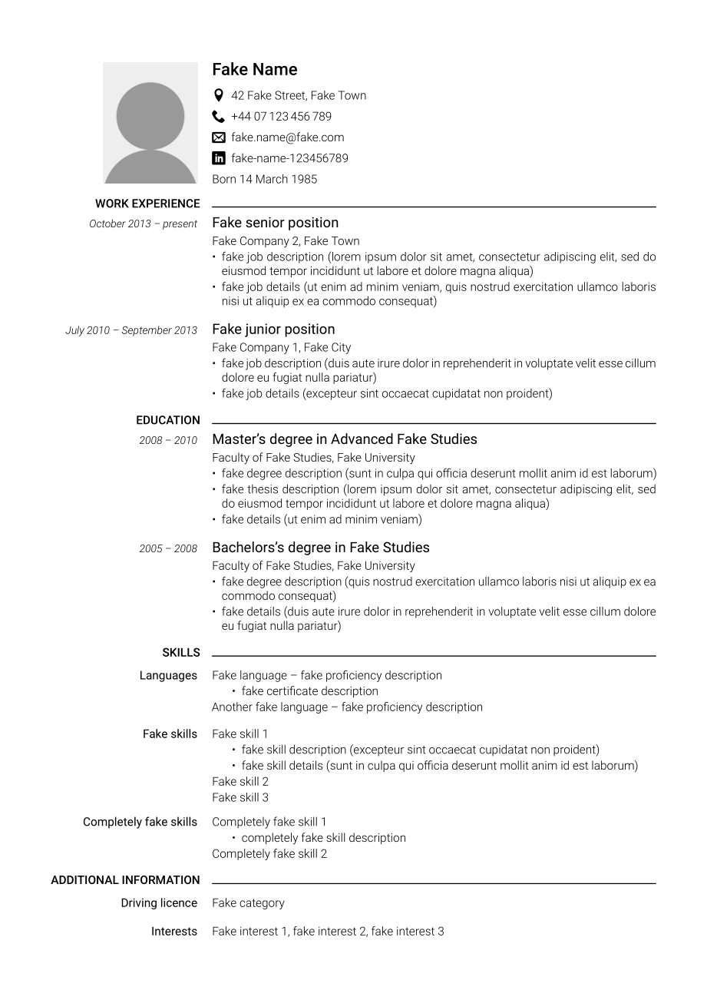
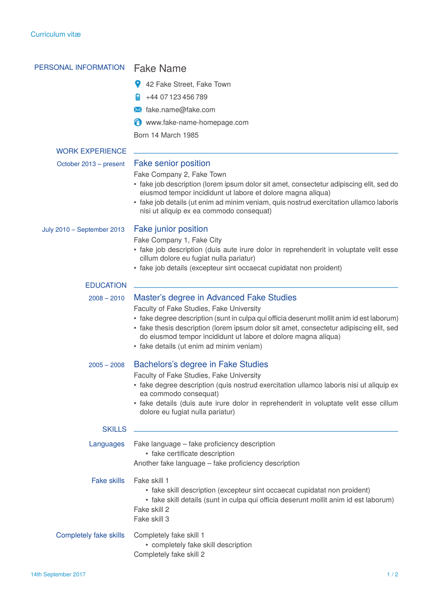

# 1.5-column-cv

XeTeX CV template with a "1.5-column" layout (narrow left column for headings,
wide right column for content), offering very simple and extensive customisation
possibilities.

## Preview

[Example 1](example-1/cv-example-1.pdf) ([edit on Overleaf](https://www.overleaf.com/latex/templates/1-dot-5-column-cv/rpcbqtrsgbxm)) | [Example 2](example-2/cv-example-2.pdf)
:------------------------------------------------------------------------------------------------------------------------------------:|:---------------------------------------:
                                                                                              | 

## Customisation

The most distinct style elements (fonts and colours) can be modified by editing
a few lines, changing the look of the output significantly with minimal effort.
However, since the template is short, extensively commented, and intentionally
as unsophisticated as possible, it is not difficult to also customise pretty
much anything else to your liking.

## Usage

For an overview of how to use the template, see the two provided example CVs
(both can be built just by running `xelatex cv-example-X.tex`). Afterwards, edit
[the template](cv-template.tex) to create your own CV – while you could just
edit one of the examples instead, the template contains additional instructions
and hints.

## Credits

The example CVs use resources from the following projects:
* [Roboto font family by Google](https://fonts.google.com/specimen/Roboto?selection.family=Roboto) (example 1);
* [IcoMoon icon pack by Keyamoon](https://icomoon.io/#icons-icomoon) (example 1);
* [TeX Gyre Heros font family by GUST e-foundry](https://www.fontsquirrel.com/fonts/tex-gyre-heros) (example 2);
* icons and colours from the [*europasscv* package by Giacomo Mazzamuto](https://www.ctan.org/tex-archive/macros/latex/contrib/europasscv) (example 2).

The layout in general is heavily inspired by the [Europass CV template by
European Union](http://europass.cedefop.europa.eu/documents/curriculum-vitae)
(but the template itself does not use any code from the above-mentioned
*europasscv* package).

## Licence

Resources from the projects listed above are licensed under the terms of their
respective licences, the rest of the repository under the MIT licence.
